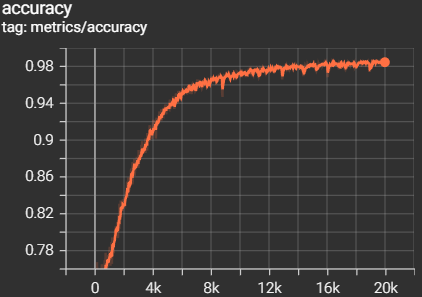
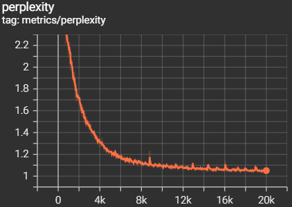

# EDM Melody Generator
This repository contains the work for the lecture Applied Deep Learning (194.077) for WS22.

[](https://pratax-edm-melody-generator-webappwebapp-utvzjr.streamlit.app/)

## Project Topic
The topic of this project is to use Recurrent Neural Networks in order to generate Electronic Dance Music melodies.

## Project Type
The type of this project is **Bring your own data** and will mainly focus on the creation of a dataset of EDM melodies in order to be able to train models to generate such melodies.

## Description
Nowadays, with the increasing availability of powerful computers on the private market and with the diffusion of Digital Audio Workstations (DAWs), it has become incredibly easy to produce a song from the comfort of our beds and more and more people are trying their luck by producing and releasing songs, dreaming of becoming famous music producers. However, making a song is a really complex process and it is extremely difficult to produce a hit song that will "catch the ears" of millions of listeners. One of the most important elements to a memorable song, especially when it comes to Electronic Dance Music (EDM), is a catchy melody and oftentimes artists struggle with coming up with one. 

The goal of this project is to create an application that facilitates the melody creation process by using deep learning methodologies to automatically generate melodies that can be used as they are or serve as a starting point to spark the imagination and creativity of artists. In particular, the type of this project is "\textbf{Bring your own data}" and the main focus will be on collecting a dataset of EDM melodies and use them to train an already existing deep learning model to generate similar melodies.

The approach that this project will use are Recurrent Neural Networks (RNN) which have proven to be really efficient in generating melodies as we can see in various publications presented at the ISMIR conference (International Society for Music Information Retrieval). Among the publications there are melody generation models like VirtuosoNet, StructureNet and other architectures based on RNNs. The reason why RNNs are suited is that they can learn the relationship each note has to the other notes being played and can use that information to generate notes based on notes that have been played previously in time. Specifically for this project, we will use the collected dataset to train MelodyRNN, a recurrent neural network designed by Google to generate monophonic melodies.

## Dataset
Having an great and ample dataset is of really high importance and in virtually any deep learning application the amount and quality of data can make the difference between a great and a poor result.

For genres like classical and pop music, big datasets already exist and an example could be the POP909 dataset, a collection of 909 pop piano performances by various professional pianists. By using this dataset it is possible to train a RNN to generate pop melodies that are to the human ear as pleasing as melodies handcrafted by professional musicians. However, when it comes to EDM, a suitable dataset hasn't yet been created. 

The main focus of this project, therefore, will be on the collection of a suitable dataset to be able to train a deep learning model on EDM melody generation. The dataset will contain monophonic melodies (not more than one note played at the same time) created by EDM artists (e.g. Avicii, Kygo, ...) saved in MIDI format (.mid), which is the standard format when it comes to storing musical information on electronic devices. In particular, MIDI does not store any audio information or any information about the sound being reproduced but rather it stores the pitch, start time, stop time and other properties of each individual note being played and is used as a musical data format by many deep learning frameworks.

## Dataset Collection
For this project, mainly three sources of training data generation have been used:
* Generating my melodies from scratch
* Using existing MIDI files 
* Recreating famous melodies from scratch

After an initial assessment, it emerged that recreating famous melodies from scratch would take about 15m per melody, so I expected to create about 160 training samples in 40h of work. To augment the dataset, I added sample melodies from some of the songs that I created myself. Additionally, to speed up the process and collect even more data, I used existing MIDI files from the internet. The existing MIDI files had to be cleaned up and processed but they turned out to be a more efficient way of creating data which helped me collect more than 200 samples in 25h, almost 2x faster than the original expectation. Finally, it is worth noting that all the melodies in the dataset are monophonic (not more than one note playing at the same time), they are named according to the convention "Artist - Title.mid", they are all labeled with original Beats Per Minute (BPM) and Key, and all notes are set to a velocity value of 80.  

## Metrics and Training
To evaluate this project, two metrics have been used:
* Accuracy 
* Perplexity

After running the first training, the goal for accuracy was set to any value above 0.9 and the goal for perplexity was set to any value below 1.3.

So far, five training runs have been performed. All the details are shown in the table below:
| Run &nbsp; | Steps &nbsp; | Training Time &nbsp; | Batch Size &nbsp; | Learning Rate &nbsp; | Model Size | Accuracy &nbsp;| Perplexity &nbsp;|
|---|--------|-------|----|-------|-----|--------|-------|
| 1 | 20.000 | 1h24m | 64 | 10e-3 | 64  | 0.9034 | 1.329 |
| 2 | 20.000 | 1h25m | 32 | 10e-3 | 64  | 0.9055 | 1.313 |
| 3 | 20.000 | 1h24m | 32 | 10e-4 | 128 | 0.8254 | 1.729 |
| 4 | 20.000 | 1h26m | 32 | 10e-3 | 128 | 0.9862 | 1.045 |
| 5 | 20.000 | 1h27m | 64 | 10e-3 | 128 | 0.9918 | 1.044 |

As we can see from the table above, a higher learning rate is to be preferred to a lower one since it yields higher accuracy values and lower perplexity scores. As for the model size, having a bigger model size is preferred since it yields better results, but if we do not have enough computing power it is necessary to reduce the size of our model. Regarding batch size, considering the same learning rate and model size, a bigger batch size yields slightly better results. The fifth run is the one that performed best both in terms of accuracy and perplexity and the figures below (adapted from TensorBoard) show the curves of the two metrics against the training step:





As a final consideration, it is worth noting that all of the runs have been performed for 20.000 global steps, and changing the hyperparameters such as model size didn't affect the training time that remained pretty much constant within all five runs.

## Work-Breakdown structure
| Individual Task &nbsp; | Time Estimated &nbsp; | Time Used |
|-------------------------------------------|------|------|
| Research Topic                            | 5h   |  8h  |
| Dataset Collection                        | 40h  |  25h |
| Network Building                          | 5h   |  5h  |
| Network Training                          | 20h  |  8h  |
| Application Development                   | 15h  |  28h |
| Final Written Report                      | 10h  |  2.5h|
| Final Presentation                        | 5h   |  2h  |

## Installation
This project was created and tested with python version 3.7. In order to install it, first clone this repository with the following command:
```
git clone --recurse-submodules https://github.com/pratax/edm-melody-generator.git
```
then, create and activate a new python virtual environment by using:
```
python -m venv edm-melody-generator
```
and finally, to install all the required packages, run the following command:
```
pip install -r requirements.txt
```

## Usage
### Train 
In order to train MelodyRNN on this custom edm dataset, first we need to convert the MIDI files to NoteSequences. In order to do so, from the main directory of this project, run the following command:
```
python magenta/magenta/scripts/convert_dir_to_note_sequences.py --input_dir="Dataset" --output_file="tmp/notesequences.tfrecord" --recursive 
```
where:
 - ```--input_dir``` specifies the relative or absolute path to the folder containing the MIDI files
 - ```--output_file``` specifies the file to be created and written with the NoteSequences

then, to create a dataset of SequenceExamples to feed the model for training, from the main directory of this project, run this command:
```
python magenta/magenta/models/melody_rnn/melody_rnn_create_dataset.py --config=lookback_rnn --input="tmp/notesequences.tfrecord" --output_dir="tmp/melody_rnn/sequence_examples" --eval_ratio=0.00 
```
where:
 - ```--config``` specifies the type of model to train between: basic_rnn, mono_rnn, lookback_rnn and attention_rnn
 - ```--input``` specifies the path to the NoteSequences file generated earlier 
 - ```--output_dir``` specifies the directory where the training ready dataset will be stored
 - ```--eval_ratio``` specifies the ratio of evaluation sequences to be created (e.g. 0.1 will assign 10% of the melodies to the evaluation set)

now we are ready to train our model. To do so, from the main directory run this command:
```
python magenta/magenta/models/melody_rnn/melody_rnn_train.py --config=lookback_rnn --run_dir="tmp/melody_rnn/logdir/run1" --sequence_example_file="tmp/melody_rnn/sequence_examples/training_melodies.tfrecord" --hparams="batch_size=64,rnn_layer_sizes=[64,64]" --num_training_steps=20000 
```
where:
 - ```--config``` specifies the type of model to train between: basic_rnn, mono_rnn, lookback_rnn and attention_rnn
 - ```--run_dir``` specifies the path where to store training logs and checkpoints 
 - ```--sequence_example_file``` specifies the path to the training ready dataset created in the previous step
 - ```--hparams``` specifies the hyperparameters of the model
 - ```--num_training_steps``` specifies the number of training steps to perform before ending the training phase

once training is over, it is possible to check the information about loss and metrics during training by running the following command:
```
tensorboard --logdir=tmp/melody_rnn/logdir
```
and then going to the following link in a browser:
```
http://localhost:6006/
```

### Test
Once training is done, it is possible to test the model by generating a certain amount of melodies. To generate melodies run the following command:
```
python magenta/magenta/models/melody_rnn/melody_rnn_generate.py --config=lookback_rnn --run_dir="tmp/melody_rnn/logdir/run5" --output_dir="tmp/melody_rnn/generated" --num_outputs=10 --num_steps=128 --hparams="batch_size=64,rnn_layer_sizes=[128,128]" --primer_melody="[60]"
```
where:
 - ```--config``` specifies the type of model to train between: basic_rnn, mono_rnn, lookback_rnn and attention_rnn
 - ```--run_dir``` specifies the directory where the trained model was saved
 - ```--output_dir``` specifies the directory where to store the generated MIDI melodies
 - ```--num_outputs``` specifies the number of melodies that will be generated
 - ```--num_steps``` specifies how long each melody will be in 16th steps (128 steps = 8 bars)
 - ```--hparams``` specifies the hyperparameters of the model
 - ```--primer_melody``` specifies the starting note of the generated melodies (60 represents the note C4 and increasing/decreasing by 1 increases/decreases the starting note by 1 semitone, e.g. 62 corresponds to the note D4)
 
## References
For the initial topic research the following references have been used:

[POP909 Dataset](https://arxiv.org/abs/2008.07142)
```
@article{wang2020pop909,
  title={Pop909: A pop-song dataset for music arrangement generation},
  author={Wang, Ziyu and Chen, Ke and Jiang, Junyan and Zhang, Yiyi and Xu, Maoran and Dai, Shuqi and Gu, Xianbin and Xia, Gus},
  journal={arXiv preprint arXiv:2008.07142},
  year={2020}
}
```
[VirtuosoNet](https://archives.ismir.net/ismir2019/paper/000112.pdf)
```
@inproceedings{Jeong2019VirtuosoNetAH,
  title={VirtuosoNet: A Hierarchical RNN-based System for Modeling Expressive Piano Performance},
  author={Dasaem Jeong and Taegyun Kwon and Yoojin Kim and Kyogu Lee and Juhan Nam},
  booktitle={ISMIR},
  year={2019}
}
```
[HRNN for Melody Generation](https://ieeexplore.ieee.org/abstract/document/8918424?casa_token=rIv9NgUcMTwAAAAA:UTvyKhPB5JTH7iMsNAb1aYzbuolXtRG5xrIvauVPyXTpESg7xMPWEaBeSL_ldt2q-QgG4Hc)
```
@article{8918424,
  author={Wu, Jian and Hu, Changran and Wang, Yulong and Hu, Xiaolin and Zhu, Jun},
  journal={IEEE Transactions on Cybernetics}, 
  title={A Hierarchical Recurrent Neural Network for Symbolic Melody Generation}, 
  year={2020},
  volume={50},
  number={6},
  pages={2749-2757},
  doi={10.1109/TCYB.2019.2953194}}
```
[StructureNet](https://archives.ismir.net/ismir2018/paper/000126.pdf)
```
@inproceedings{medeot2018structurenet,
  title={StructureNet: Inducing Structure in Generated Melodies.},
  author={Medeot, Gabriele and Cherla, Srikanth and Kosta, Katerina and McVicar, Matt and Abdallah, Samer and Selvi, Marco and Newton-Rex, Ed and Webster, Kevin},
  booktitle={ISMIR},
  pages={725--731},
  year={2018}
}
```
[MelodyRNN](https://magenta.tensorflow.org/2016/07/15/lookback-rnn-attention-rnn)
```
@misc{melody-rnn-2016,
    author = {Elliot Waite},
    title = {
        Generating Long-Term Structure in Songs and Stories
    },
    journal = {Magenta Blog},
    type = {Blog},
    year = {2016},
    howpublished = {\url{https://magenta.tensorflow.org/2016/07/15/lookback-rnn-attention-rnn}}
}
```